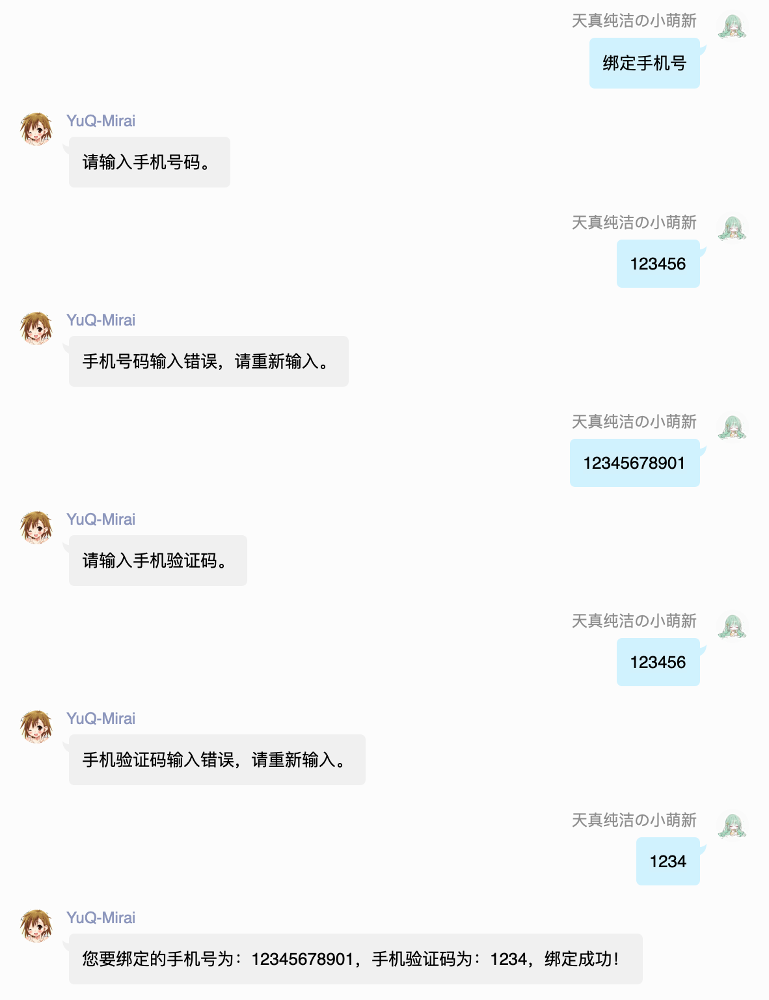

<div align="center">
   
<br />
<h3>YuQ</h3>
</div>

----
YuQ 是一个机器人快速开发框架。[开发文档](https://yuqworks.github.io/YuQ-Doc/)

现在 YuQ 将不仅仅是 QQ 机器人。  
借由高度封装，YuQ 可以在各个平台做出兼容实现的 Runtime。  
帮助您在多平台快速展开机器人。

 - 路由映射
 - 依赖注入
 - 定时任务
 - ORM支持
 - 上下文消息
 
YuQ 使用 Kotlin 开发，并且完美支持 Java 与 Kotlin。
 
在 YuQ 我们仅需很简单的代码，就可以完成很复杂的功能。  
比如，我们要针对一个指令 "Hello"，进行一个标准的 "Hello World!" 消息回复。
```Java
@GroupController
public class GroupMenu{ 
    @Action("Hello")
    public String menu(){
        return "Hello World!";
    } 
}
```
YuQ 会在指令式机器人的开发中，提供非常好的帮助，让开发者能有更好的开发体验。  
在 Controller 中，我们的 Action 方法，返回的内容，会直接构建成消息，并发送当当前消息源。  
通过路由映射，我们可以很方便的编写指令，只需要将 Class 声明为一个 Controller，并且编写 Action 方法。  
其余的，YuQ 会帮您完成。  

比如我们想禁言一个人，禁言的指令为"ban @xxx或QQ号码 time"
我们只需要编写：
```Java
@GroupController
public class GroupMenu{
     @Action("ban {ban} {time}")
     public String ban(Member ban, int time){
         ban.ban(time);
         return "好的！";
     }
}
```
这样，我们就可以很轻易的完成 ban 这个指令了。

对于需要连续对话的指令式机器人，基于 YuQ 也可以轻松满足。  

通过 ContextSession 提供的 waitNextMessage 方法，或者 ContextController，我们可以轻松完成上下文对话的机器人。  
